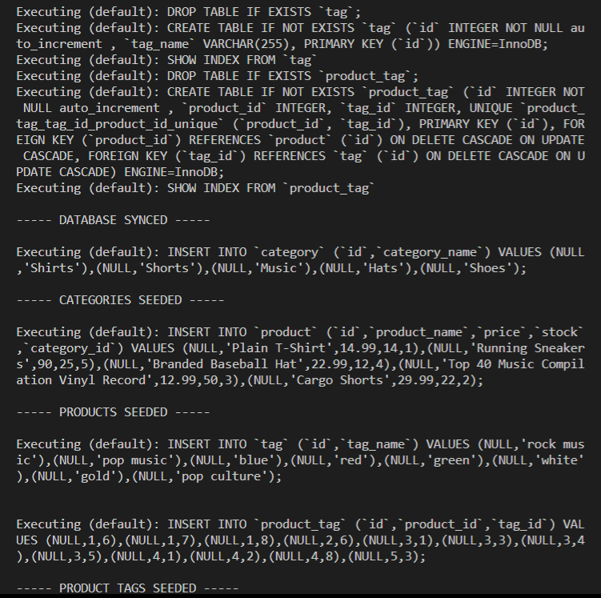
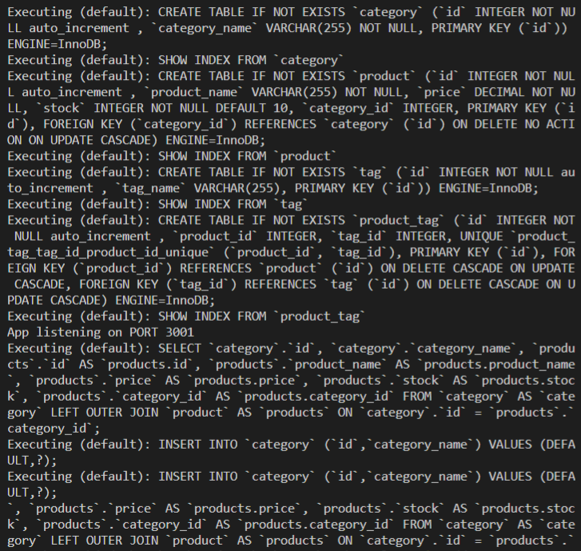
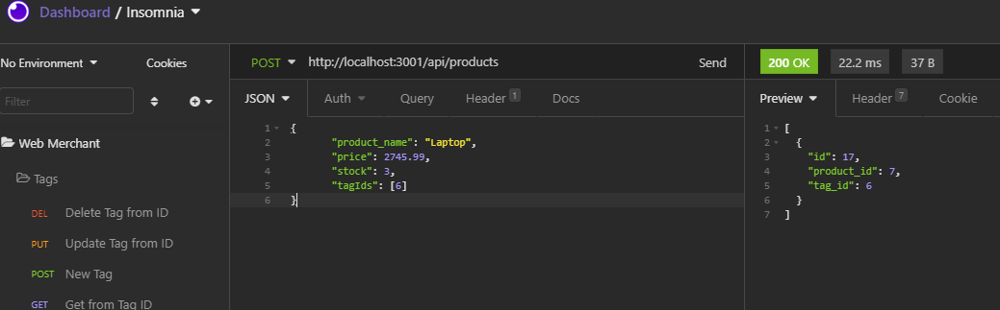

# Web Merchant

---------------------------------------

## Description
Web Merchant is an online e-commerce site that holds data about products.  

Each product is a part of category and can have as many tags as needed.  

The site stores information in a database that can be accessed through the API endpoints to Create, Read, Update and Delete information.

---------------------------------------

Project Link: 
[web-merchant GitHub link](https://github.com/jaderiver62/web-merchant)

---------------------------------------

## Table of Contents
* [Installation](#installation)
* [Usage](#usage)
* [License](#license)
* [Testing](#testing)
* [Questions](#questions)

---------------------------------------

## Installation
This project runs using Node, npm and mysql.

First clone the repo into your desired folder.

Navigate to the folder you stored the repo in your command line - then navigate to the Develop directory and follow the following steps:

>
>$ npm install -y 
>

---------------------------------------

>
>$ npm install mysql2 express sequelize dotenv
>

---------------------------------------

Next log into mysql to create the database 'web_merchant_db'
>
>$ mysql -u root -p
>
>Enter Password: ********
>

---------------------------------------

>
> mysql> source db/schema.sql;
>
> mysql> show databases;
>
> mysql> quit
>

---------------------------------------

Next create a .env file with the following properties in the Develop directory (alter as needed):

>
> DB_NAME='web_merchant_db'
>
> DB_USER='root'
>
> DB_PW='YOUR_PASSWORD_HERE'
> 

---------------------------------------

Save the .env file.  

## Usage

To use Web Merchant - navigate to the command line in the Develop directory and run the following commands:

>
> npm run seed
>
---------------------------------------
You should see the following image to confirm it has seeded correctly:

Now to start the server:

>
> npm start
>
---------------------------------------

If this is working correctly you should see a response such as this image:

---------------------------------------

## Testing
This should be tested using Insomnia Core.

Once the installation and usage instructions have been followed to seed the database and to start the server - it can be tested using the endpoints on Insomnia.

Please refer to the following video for a walkthrough:
[Video Link](http://mylink.com)
---------------------------------------

Written using:

                    
* JavaScript
   
* ES6
   
* Node
   

---------------------------------------

## Questions

For any input, concerns, bugs or questions please get in touch!  Simply reach out to [Nina Cummings](https://github.com/jaderiver62) via GitHub or via e-mail: jaderiver64@gmail.com.

---------------------------------------

## Licence

#### This project is licensed under the [The Unlicense](https://unlicense.org).
#### &copy; 2021 Nina Cummings

---------------------------------------
    